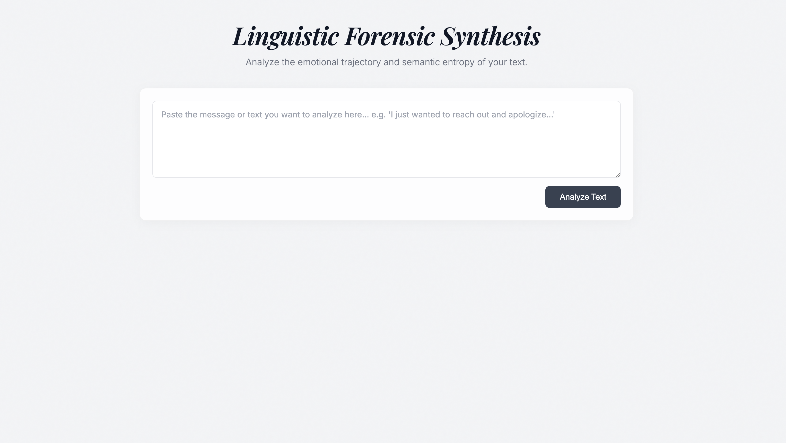

# Linguistic Forensic Synthesis



## The Evolution of this Project

This project began as a single, monolithic Python script designed to test local semantic analysis using HuggingFace `transformers`. Initially, it simply parsed text, scored the sentiment using a multilingual BERT model, and applied a custom mathematical formula to calculate the Shannon Entropy (the cognitive unpredictability) of the author's word choices.

But raw data is only half the story. To make these metrics truly insightful, the project evolved into a full-stack platform. 

We integrated the **Gemini 2.5 Flash** Large Language Model to act as the "brain," ingesting the raw BERT and Entropy scores to generate a highly engaging, human-readable "Linguistic Forensic Synthesis".

Finally, we wrapped the entire intelligence pipeline in an elegant web application. We built a custom Fast API backend, a vanilla HTML/JS frontend with a sleek monochrome glassmorphic design, and fully containerized the environment using Docker and Nginx.

## Architecture & The "Instant Switch"

The platform now supports three distinct AI Personas:
- **Friend (Supportive)**
- **Mentor (Constructive)**
- **Expert (Forensic)**

To achieve zero-latency persona switching, the backend employs **Asynchronous Batching**. When a user clicks "Analyze Text", the Python backend uses `asyncio` to simultaneously ping the Gemini API three times—once for each persona. The frontend receives the entire payload and caches it, allowing the user to instantly toggle between personas via a dropdown, which dynamically rebuilds the `Chart.js` UI without ever triggering another loading screen.

## Tech Stack
- **Frontend**: Vanilla HTML5, CSS3, JavaScript, Chart.js
- **Backend API**: Python 3.12, FastAPI, Uvicorn
- **Machine Learning**: HuggingFace `transformers` (BERT Sentiment Analysis)
- **Generative AI**: Google `google-genai` SDK (Gemini 2.5 Flash)
- **Orchestration**: Docker, Docker Compose, Nginx

## Running Locally

1. **Clone the repository.**
2. **Add your API Key:** Create a `.env` file in the root directory and add your Google AI Studio key:
   ```env
   GEMINI_API_KEY=your_key_here
   ```
3. **Spin up the containers:**
   ```bash
   docker-compose up --build
   ```
4. **Access the App:** Open your browser and navigate to `http://localhost:8080`.

## The Vibecoding Methodology

This project is a showcase of **Vibecoding**—a modern paradigm where humans and autonomous AI agents collaborate to build complex systems. 

Rather than relying solely on traditional documentation for human developers, this repository is structurally designed to natively onboard and constrain autonomous AI agents:

- **`AI_SETUP.md`**: An alternate setup guide specifically tailored for Large Language Models. It maps out the directory structure, environment variables, and Docker orchestration commands so any agent can instantly understand how to operate the codebase.
- **`.agent/rules/`**: This directory contains local workspace rules (`workspace.agent`). These act as strict guardrails, forcing the AI to consult context files and document architectural changes before pushing code.
- **`context/`**: A dedicated knowledge base containing markdown files that define the theoretical parameters of the application (e.g., Semantic Entropy textbook definitions). Agents read this *before* writing code to ensure their implementations are theoretically sound.

By designing the repository around these constraints, we ensure that autonomous agents can freely build, debug, and refactor the platform without breaking its core architectural and philosophical vision.
